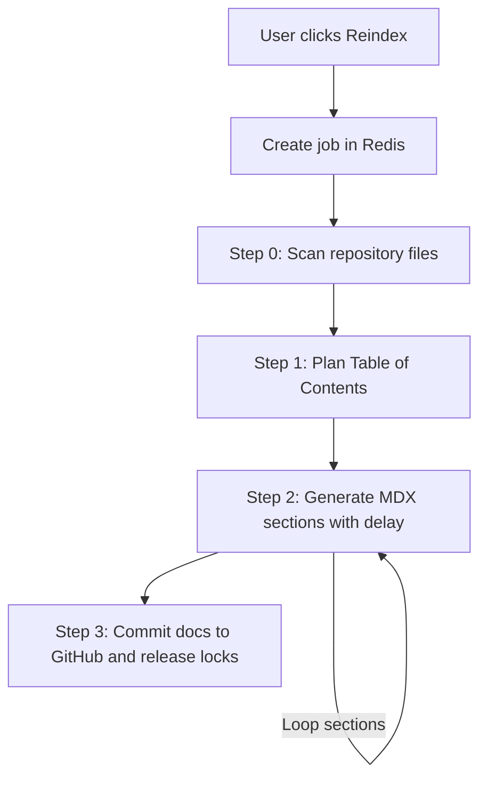

# GitDex

Transform any GitHub repository into beautiful, AI-powered interactive documentation in seconds.

GitDex analyzes your codebase structure, plans a table of contents, writes comprehensive markdown docs using LLMs, and presents it in a search-ready web reader with an interactive AI chat assistant.

---

## Key Features

* **Multi-Step Indexing**: High-performance pipeline that scans, plans, and writes documentation.
* **AI Code Assistant**: Chat interface using manual ReAct loops to answer questions about the repository.
* **Interactive Diagrams**: Automatic Mermaid diagram generation for visualizing codebase architecture.
* **Serverless Queueing**: Custom-built queue system using Upstash Redis and QStash to bypass serverless execution timeouts.

---

## How It Works

To support serverless timeout limits, the indexing workflow is decoupled into step-by-step executions orchestrated by QStash:

---

## Project Structure

This repository is split into two packages:
* **[Client](./client/README.md)**: Next.js frontend, Fumadocs reader, and assistant chat UI.
* **[Server](./server/README.md)**: Express API backend, Redis queue, and Gemini pipeline handler.

Refer to the links above for environment configuration and run instructions for each package.

---

## Technology Stack

* **Frontend**: Next.js, Tailwind CSS, Fumadocs, assistant-ui
* **Backend**: Node.js, Express, Upstash Redis, Upstash QStash
* **AI**: Google Gemini (via Google AI SDK)
* **Integration**: Octokit (GitHub REST API)
